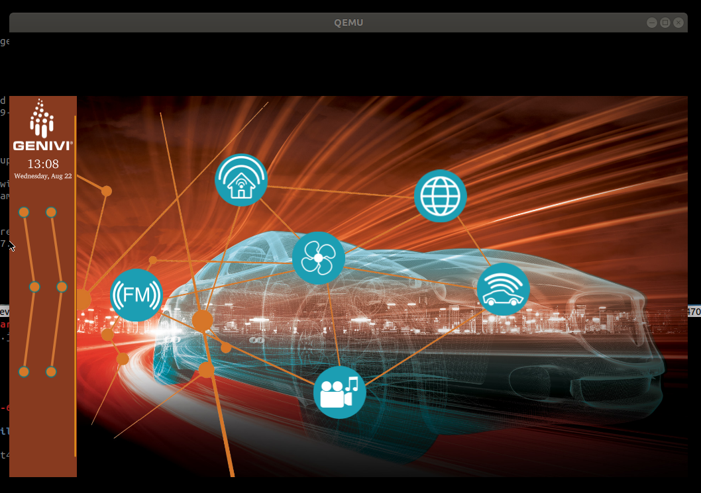

# Genivi Development Platform (GDP)

In this short tutorial we will create a GDP image from the master branch.

## Build a qemu x86_64 image

* Clone the repository:
```
$ mkdir genivi-dev
$ git clone https://github.com/GENIVI/genivi-dev-platform.git genivi-dev
```

* Build the image through bitbake:
```
$ cd genivi-dev
$ source ./init.sh qemux86-64
$ bitbake -k genivi-dev-platform
```

Oh yes! It will take time...

## Compile Qemu with hardware graphics acceleration

* Compile it with the proper options

```
$ sudo apt-get install build-essential libepoxy-dev libdrm-dev libgbm-dev libx11-dev libvirglrenderer-dev libpulse-dev libsdl2-dev libpixman-1-dev
$ wget https://download.qemu.org/qemu-2.12.1.tar.xz
$ tar xf qemu-2.12.1.tar.xz
$ cd qemu-2.12.0
$ ./configure --enable-sdl --with-sdlabi=2.0 --enable-opengl --enable-virglrenderer --enable-system --enable-modules --audio-drv-list=pa --target-list=x86_64-softmmu --enable-kvm
```

In the output the following shall be listed yes:

```
SDL support       yes (2.x.y)
virgl support     yes
KVM support       yes
OpenGL support    yes
OpenGL dmabufs    yes

```

Compile qemu.

```
make -j$(grep -c ^processor /proc/cpuinfo)
```

The file x86_64-softmmu/qemu-system-x86_64 must exist after the compilation has finished sucessfully.


# Run it on qemu

Create a user variable that points to x86_64-softmmu/qemu-system-x86_64. Call it QEMU_VIRGL_PATH .

Take into account that the output of your genivi build is in the folder genivi-dev/gdp-src-build/tmp/deploy/images/qemux86-64 .

To launch the genivi image in qemu, from the build images folder do:

```
$QEMU_VIRGL_PATH" \
-kernel bzImage \
-drive "file=genivi-dev-platform-qemux86-64.ext4,format=raw" \
-enable-kvm \
-device virtio-vga,virgl=on \
-device nec-usb-xhci \
-device usb-tablet \
-net nic \
-net user,hostfwd=tcp::5555-:22 \
-cpu core2duo \
-no-reboot \
-soundhw ac97 \
-m 512 \
-display sdl,gl=on \
--append "vga=0 uvesafb.mode_option=640x480-32 root=/dev/hda rw mem=512M oprofile.timer=1
```

After boot you should see something like this.



If you need yo can connect by ssh to your localhost port 5555 which is redirecting to qemu port 22.

``` 
ssh root@127.0.0.1 -p 5555
```

User *root* , password *root* . 

# Reference

[Qemu with hardware Graphics acceleration](https://at.projects.genivi.org/wiki/display/GDP/QEMU+with+hardware+graphics+acceleration)